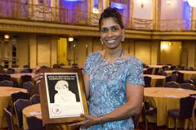

Quando falamos em engenheiros nosso espaço amostral é gigante. Temos vários exemplos de todas as áreas possíveis, mas o que acontece quando fazemos o recorte feminino e perguntamos acerca das engenheiras? As opções que lhe vêm na cabeça se reduzem muito? E agora, se te perguntassem sobre engenheiras negras? Saberia apontar alguma? A ideia desse artigo é, primeiramente, fazer você se questionar. Por que temos menos engenheiras mulheres e por que quando falamos de mulheres negras o número reduz ainda mais? 

Internalize estes questionamentos para refletir um pouco mais tarde, porque o que queremos, neste momento, é que você conheça a Aprille Ericsson.

 

## A APOLLO PLANTOU UMA SEMENTE

Nascida no ano de 1963, em Bed Stuy, Brooklyn, na cidade de Nova York; Aprille sempre foi estudiosa, amante de esportes e de quadrinhos. A engenheira aponta alguns momentos que alavancaram seu entusiasmo pela ciência: o primeiro deles foi ao assistir o lançamento da missão Apollo, quando ainda era criança. A partir daí, uma sementinha foi plantada. Alguns anos depois, ganhou seu primeiro prêmio em uma feira de ciências e pouco mais tarde participou do MITES (Minority Introduction to Engineering & Science) no Massachusetts Institute of Technology (MIT), durante o verão no seu primeiro ano do Ensino Médio, foi neste programa onde teve seu primeiro contato com design de foguetes.

## DO SONHO À REALIDADE

Aprille formou-se em Engenharia Aeronáutica e Aeroespacial no MIT em 1986, aos 23 anos. Pouco depois conquistou o seu mestrado e doutorado em Engenharia Mecânica, pela Universidade de Howard, tornando-se a primeira Doutora Afro-americana. Posteriormente, tornou-se a primeira mulher Afro-americana a receber o Phd em Engenharia no NASA Goddard Space Flight Center (GSFC). 

Há 29 anos trabalhando na NASA, Aprille já fez parte de diversas missões. No centro de vôo Espacial Goddard ela começou trabalhando na concepção de sistemas de controle. Passou a ser conhecida na NASA como a cientista dos foguetes, pois uma de suas funções é projetar e construir os sistemas que controlam as espaçonaves.

 

## PROJETOS

Em um vídeo apresentado no World Science Festival, Aprille conta que seu projeto favorito é, até o momento, o Lunar Reconnaissance Orbiter (LRO), pois remete a quando estava na primeira série e teve a oportunidade ver o homem chegando a lua. Aprille trabalhou em todas as etapas de confecção do LRO, um satélite capaz de medir distâncias com extrema precisão. O LRO torna possível a criação de mapas tridimensionais da Lua, permitindo a visualização de crateras muito pequenas. 

Ela também faz parte do projeto do James Webb Space Telescope (JWST), que possui previsão de lançamento para 2021. Espera-se que, caso tudo ocorra bem, o JWST colete dados que possam dar dicas sobre a velocidade de expansão da Via Láctea.

## PREMIAÇÕES

Aprille já foi contemplada com diversos prêmios, entre eles, o prestigiado Washington Award, já conquistado anteriormente por Henry Ford, Neil Armstrong. Por mais de cem anos o prêmio vem reconhecendo engenheiras e engenheiros cujas realizações promovem a felicidade, o conforto e o bem estar da humanidade.

> Durante a premiação ela disse: "Tive a oportunidade de falar com muitos jovens em todo o país e no mundo. Consigo inspirar os jovens e ter um impacto no futuro de engenheiros e cientistas. Quem poderia ter pedido um emprego melhor com um legado tão profundo? ”

E aí? Ficou inspirada? Quer saber mais um pouco sobre a Aprille Ericsson e o seu trabalho? [Assista à palestra da engenheira no TEDx Baltimore.](https://www.youtube.com/watch?v=LQ4jlgzOwHs&t=156s)

Referências:

[https://www.nsbp.org/nsbp-news/bhm-physics-profiles/2019-honorees/131-aprille-ericssonjackson](https://www.nsbp.org/nsbp-news/bhm-physics-profiles/2019-honorees/131-aprille-ericssonjackson)

[https://usasciencefestival.org/people/draprilleericsson/](https://usasciencefestival.org/people/draprilleericsson/)

[https://www.loc.gov/loc/lcib/0104/rocketeer.html](https://www.loc.gov/loc/lcib/0104/rocketeer.html)

[https://www.youtube.com/watchtime\_continue=8&v=DywbwPU7Zzw&feature=emb\_logo](https://www.youtube.com/watchtime_continue=8&v=DywbwPU7Zzw&feature=emb_logo)

[https://www.nasa.gov/feature/goddard/2016/nasa-goddard-s-aprille-ericsson-wins-prestigious-washington-award](https://www.nasa.gov/feature/goddard/2016/nasa-goddard-s-aprille-ericsson-wins-prestigious-washington-award)

### Quer ficar ligado nos nossos novos artigos?

Cadastre-se para não perder mais!
