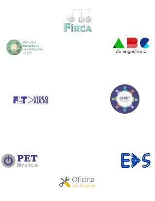

#### Cálculo A para Física I

Nesta atividade é passado o conhecimento necessário para o aluno aplicar o conteúdo de Cálculo A na disciplina de Física I, pois há uma lacuna na componente curricular do curso. [Saiba Mais](./portfolio/calculo-a-para-fisica-i/)

#### Extensão Motivacional

Principal atividade da tríade "Extensão", que busca aproximar o PET e o mundo acadêmico à comunidade externa da UFBA. [Saiba Mais](./portfolio/extensao-motivacional/)

#### PET Escambo

Iniciativa para auxiliar os estudantes em seus projetos de Laboratório Integrado através da troca de componentes eletrônicos. [Saiba Mais](./portfolio/pet-escambo/)

#### ABC da Engenharia

Insere os estudantes recém-ingressos no curso de Engenharia Elétrica da UFBA no contexto das práticas laboratoriais que enfrentarão a partir do segundo semestre. [Saiba Mais](./portfolio/abc-da-engenharia/)

####  Grupo de Estudos

Atividade que busca agregar estudantes que não estão integrados nas disciplinas, de modo a fomentar o contato através de grupo de estudos. [Saiba Mais](./portfolio/grupo-de-estudos-do-pet-gepet/)

#### Conexão PET

Evento que visa proporcionar discussões e reflexões acerca das vivências do estudante dentro e fora dos muros da universidade. [Saiba Mais](./portfolio/conexao-pet/)
