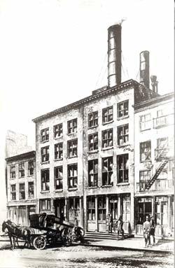
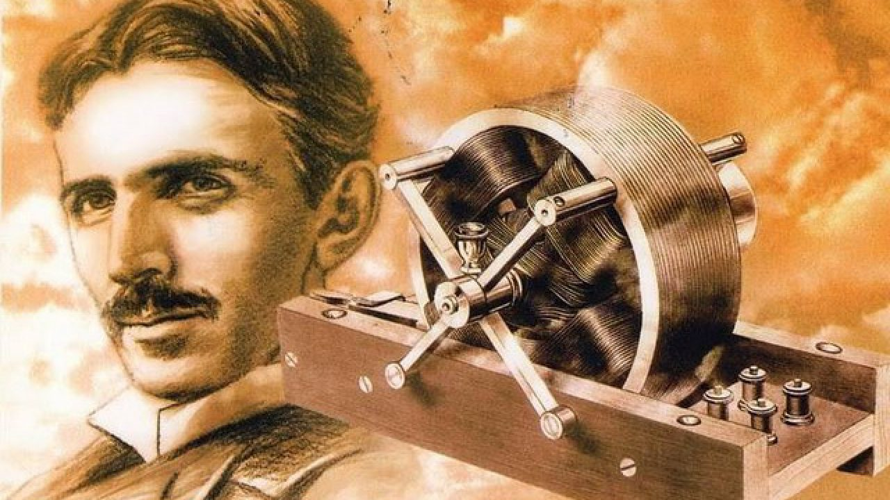
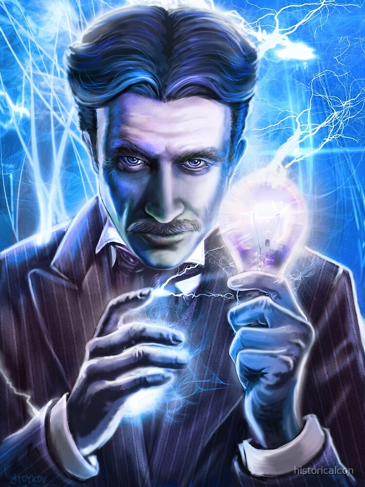

## “Faça-se a luz”

Na segunda metade do século XIX, as máquinas ainda exigiam a força mecânica e o vapor. A iluminação dos ambientes dependia das luminárias a gás, a querosene ou a óleo. Essas não eram capazes de se manterem acesas por muito tempo. Tal contexto atraiu a atenção do inventor mais famoso do mundo: Thomas Edison.

Nessa época, ele já havia acumulado muita fama e carregava o apelido de “Mago de Menlo Park”. Até que 2 anos após ter inventado o fonógrafo, ele investiu seus esforços na busca de uma fonte de luz capaz de substituir as ultrapassadas luminárias.

Edison se deparou com a derrota em centenas de tentativas. Apesar disso, sua persistência permitiu que, em 21 de Outubro de 1879, ele descobrisse uma forma segura e durável de ligar uma lâmpada com a energia elétrica. O segredo para essa conquista foi o uso do filamento de carbono pelo qual a corrente elétrica atravessa. O uso desse elemento permitiu que a lâmpada fornecesse luz por mais tempo. 

Entretanto, o uso do projeto de Edison apresentava ainda um empecilho: os ambientes da época não tinham um sistema elétrico instalado. Isso, porém, não o impediu de desenvolver um modelo capaz de atender a seu novo invento.

O projeto era descrito por Edison como simples e seguro e o seu funcionamento se baseia na corrente contínua ou DC (_Direct Current_). Ademais, esse novo sistema era consideravelmente mais barato que a produção de energia a gás, líder do setor energético até o momento.

Com tantos aspectos positivos, Edison atraiu muitos investimentos para sua companhia elétrica, a _Edison Electric_. Por conseguinte, em 4 de Setembro de 1882, foi inaugurada a primeira usina de energia elétrica do mundo. Ela ficava na cidade de Manhattan e se chamou Estação _Pearl Street_. Os investidores confiavam tanto na ideia do renomado inventor que, em menos de 2 anos, ele conseguiu construir mais 18 novas usinas espalhadas pelos Estados Unidos.

A crescente construção de usinas soava como um triunfo para Edison, mas elas vieram acompanhadas por uma problemática: o alcance do seu fornecimento energético. Elas só permitiam a iluminação dos ambientes a um raio de cerca de 800 metros. Isso fez com que só pudessem ser construídas nas regiões com alta densidade populacional para serem viáveis economicamente. Desse modo, muitas regiões mais isoladas não tiveram acesso a essa fonte de energia.

Estação Pearl Street - Ilustração de Hackaday

## O outro lado

Na cidade austríaca de Graz, o Físico Nikola Tesla tinha ideias que iam de encontro aos planos de Edison. Ele idealizou o funcionamento de um motor pelo uso da corrente alternada ou AC (_Alternative Current_), pois a considerava mais eficiente na geração energética.

Após muitas tentativas, Tesla consegue um protótipo funcional baseado em corrente alternada.

Em 1884, Tesla é indicado por seu supervisor para trabalhar na _Edison Electric_. Nikola vê nos Estados Unidos a oportunidade de apresentar as ideias que havia tido na Europa e de desenvolver seus projetos.

Como forma de atestar a qualidade de seu novo funcionário, Edison lança-lhe um desafio. Ele pede para Tesla consertar o gerador do navio _SS Oregon_.

A dificuldade da tarefa era grande, pois aquela foi a primeira embarcação a ter esse tipo de gerador instalado, mas Tesla obteve êxito.

Motor de Indução elétrica - Ilustração de i-Técnico

## A gota d’água

Apesar de trabalhar com o sistema elétrico de Edison, Tesla ainda acredita na capacidade da corrente alternada em levar eletricidade para um número maior de pessoas. A ideia dele consistia em uma estação central de energia que tivesse apenas um gerador com essa corrente. Contudo, Edison reprimia esse pensamento porque acreditava que tal modelo era perigoso, considerando as voltagens usadas na época e a falta de controle sobre o sistema.

Em vez disso, ele sugeriu que Tesla aperfeiçoasse o modelo da _Edison_ Electric e lhe prometeu uma recompensa de 50000 dólares caso ele conseguisse. Então, Nikola percebeu como poderia aumentar a potência dos geradores de corrente contínua.

Todavia, Edison não cumpriu com a sua palavra e Tesla não recebeu o prêmio acordado. Isso fez com que a _Edison Electric_ perdesse um funcionário e ganhasse um adversário com ideias promissoras.

 

## A vala de Edison

Em busca de um novo emprego, Tesla tem novamente seu caminho cruzado com a _Edison Electric_. Ele arrumou um trabalho como cavador de valas para passagem subterrânea de cabos da empresa de Edison. Ironicamente, nessa nova profissão, Nikola conseguiu apresentar suas ideias para o superintende do projeto de escavação e ele o indicou para um investidor de _Wall Street_.

Tesla faz uso do experimento com um ovo girando sob controle da eletricidade para demonstrar um campo magnético giratório com corrente alternada. A analogia é um sucesso e Nikola consegue atrair seus primeiros investidores.

 

## Quanto vale uma ideia?

Na primeira metade de 1887, Tesla usava os investimentos recebidos para a consolidação de uma companhia própria, sob o ideal de fornecer eletricidade para um público menos restrito.

Com isso, ele buscava aumentar a potência da AC e percebeu um fato interessante. Como a corrente alternada viaja de maneira ondulatória, há espaços entre os picos. A sua ideia consistia em adicionar um segundo sinal dessincronizado com o primeiro para o preenchimento desses espaços.

Além da vantagem de sua corrente permitir a transmissão elétrica a longas distâncias, Tesla quer provar que ela pode atuar no funcionamento de máquinas.

Por outro lado, a empresa de Edison não consegue atender à demanda de fornecimento energético, mas se mantém fiel à corrente contínua. Essa fidelidade custava cada vez mais investimentos dos bancos e do próprio inventor.

Nikola Tesla - Ilustração de HistoriaIcon

## Uma parceria de sucesso

O sistema de Tesla permitiu que o motor funcionasse com fricção menor e fornecesse energia com mais eficiência. Isso ampliou as aplicações do seu modelo elétrico.

A conquista de Nikola chamou a atenção de um dos homens mais ricos do solo estadunidense na época, George Westinghouse. Esse investidor decidiu apostar na compra das patentes de Tesla e essa parceira solidificou os concorrentes de Edison.

Restava ainda um último desafio: a corrente alternada, sujeita a altas voltagens (exigidas para um longo alcance ou funcionamento de máquinas maiores), era perigosa e exigia muitos mecanismos de segurança para evitar sua letalidade.

Em busca de uma solução, Tesla recorreu ao uso de um transformador o qual possibilita que a tensão diminua pela indução eletromagnética, garantindo a segurança do sistema elétrico.

 

## Golpe baixo

Apesar de todas as vantagens da AC, Edison mantém sua opinião inalterada. Ele busca usar de seu renome para convencer o maior número de pessoas sobre os perigos do sistema elétrico de Tesla.

Inicia-se, dessa maneira, uma campanha anticorrente alternada. A fim de obter apoio para essa causa, Edison eletrocuta inúmeros animais até a morte com a AC como forma de espantar os espectadores quanto ao uso desse modelo.

Essas demonstrações fizeram com que Edison fosse convidado, pelo estado de Nova Iorque, para desenvolver uma forma menos dolorosa de executar criminosos. Assim, Thomas recomenda o uso do sistema adversário para a primeira cadeira elétrica. Então, o modelo de Tesla torna-se conhecido pela sua “corrente da morte”.

 

## O ultimato

O cenário para um confronto final começou a se tornar visível quando uma comissão das Cataratas do Niágara busca se associar a um sistema elétrico para a geração energética do local.

Edison tenta convencer seus investidores de que a corrente contínua é a ideal para o projeto requisitado, mas os diretores da _Edison Electric_ reconhecem o sistema elétrico com a corrente alternada como a melhor opção. Por conseguinte, Thomas é afastado e o nome da empresa torna-se _General Electric_.

Do outro lado, Tesla apresenta seu projeto à comissão e sua ideia é vista como revolucionária. Desse modo, Westinghouse consegue o contrato para geração energética com uma das maiores fontes naturais de energia da América do Norte.

O resultado desse confronto consolida a vitória de Tesla na Batalha das correntes.

Mesmo com o sucesso da corrente alternada, a Westinghouse Electric não suportou os custos dos confrontos jurídicos com Edison e das patentes de Tesla, o que a encaminhava à falência. Para evitar isso, Nikola concede suas taxas de licenciamento, custando-lhe uma fortuna. Apesar disso, todo seu empenho não foi em vão, pois atualmente as ideias de Tesla dominam a eletricidade gerada e distribuída ao redor do mundo.

## Referências

BATALHA de Genius Edison vs Tesla. Direção: Paul Abascal. Produção: Stephen David. \[_S. l._\]: National Geographic, 2015.

BATALHA das correntes. Direção: Alfonso Gomez-Rejon. \[_S. l._: _s. n._\], 2019. DVD.

25 jan. 2017. Ilustração. Disponível em: https://hackaday.com/2017/01/25/tesla-vs-edison/. Acesso em: 1 jun. 2020.

### Quer ficar ligado nos nossos novos artigos?

Cadastre-se para não perder mais!
