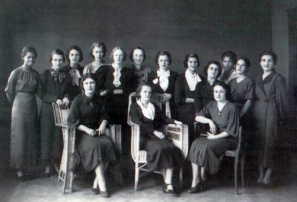
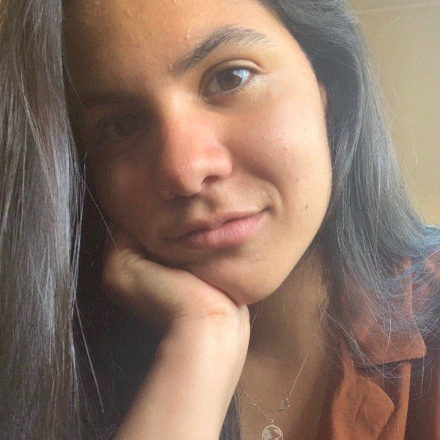

## **OS PRIMEIROS ANOS**

Nascida em 13 de janeiro de 1913, Enedina Alves foi a primeira mulher negra a se graduar em Engenharia no Brasil, sendo a quinta mulher a finalizar o curso de engenharia no país e também a primeira a se graduar em Engenharia Civil no Sul do País. Os pais de Enedina, Virgília Alves Marques e Paulo Marques, se separaram quando a menina era ainda muito jovem. Após a separação, Dona Virgília, que trabalhava como empregada doméstica, foi trabalhar e viver na casa do Major Domingos Nascimento. A jovem menina tinha a mesma idade da filha do Major Domingos e, por isso, ele as matriculou na mesma escola, para que pudessem fazer companhia uma para a outra. Apesar da oportunidade oferecida para ela, Enedina teve uma infância baseada no aprendizado de tarefas domésticas, atividade com a qual ela trabalhou até a sua diplomação como Professora Normalista em 4 de dezembro de 1931.

 

\[caption id="attachment\_2142" align="alignleft" width="424"\] Enedina e suas colegas, quando atuava como professora\[/caption\]

## **A CARREIRA COMO PROFESSORA**

Após sua diplomação, Enedina iniciou sua carreira como professora e começou a dar aulas para crianças no interior do Paraná. Pouco depois, em 1935, a jovem professora teve que retornar a condição de aluna por uma determinação do Estado, que através das leis de educação determinou que para exercer a profissão os profissionais deveriam passar por uma capacitação de três anos, utilizando recursos próprios, e também realizar um curso complementar para o ingresso no Ensino Superior. Foi então que Enedina realizou seu curso complementar de Pré-Engenharia, finalizado em 1939.

 

## **O AMOR PELA ENGENHARIA**

Enedina sempre foi apaixonada pela matemática e por disciplinas de ciências exatas, porém o desejo dela não era apenas de ensinar, mas também de colocar projetos em prática, aplicando seus conhecimentos teóricos. Por isso, em 1939, a jovem estudante realizou um requerimento, escrito com as próprias mãos, solicitando a inscrição para os exames de ingresso no Curso de Engenharia Civil.

Após obter sucesso nos exames, a mais nova estudante de Engenharia teve que lidar com mais algumas preocupações, os custos da Universidade, apesar de naquela época existir um programa de gratuidade, era muito raro que pessoas consideradas humildes fizessem uso do programa, que na maioria das vezes, contemplava pessoas influentes, como relatado por Adelino Silva, Colega de Enedina e Professor Normalista, em entrevista para um artigo publicado na Revista Vernáculo em 2011;

> _Enedina pagava \[...\], ela não ganhou o auxílio, o ensino gratuito era para os filhos dos peixinhos \[...\] eu requeri e o requerimento morreu no protocolo, nunca ninguém foi lá atrás de mim, requeri três anos nunca consegui, o último ano quem conseguiu pra mim foi o Diretório de Engenharia, porém eu já estava em uma situação que era boa e a Enedina nunca conseguiu._

Durante seu período na Universidade, Enedina trabalhou como professora e empregada doméstica, como forma de custear seus estudos e em 1945 concluiu a graduação em Engenharia Civil, tornando-se a primeira mulher negra Engenheira do país.

 

## **ENEDINA MARQUES, ENGENHEIRA**

Logo após se formar, Enedina ingressou na secretaria de Estado de Viação e Obras Públicas do Paraná, onde atuou como auxiliar de Engenharia. Após muito tempo e esforço, ela conseguiu fazer carreira no setor público, onde ocupou posições como Chefe de Hidráulica da divisão de Estatísticas e também do Serviço de Engenharia do Paraná, além de trabalhar no Departamento Estadual de Águas e Engenharia Elétrica do Paraná. Muitos julgam que o projeto mais importante do qual Enedina participou foi a obra para o aproveitamento das águas dos Rios Capivari, Cachoeira e Iguaçu.

Os relatos contam que a Engenheira era muito vaidosa, mas quando estava em uma obra utilizava sempre o uniforme padrão, um macacão com um cinto. E era nesse cinto que ela carregava a sua arma. Sim, uma arma.

Enedina era conhecida por não tolerar posturas machistas e, quando seus colegas não a deixavam falar ou tinham uma postura inadequada, ela dava tiros para cima, como forma de amedrontar eles e impor respeito.

 

## **EXEMPLO**

Apesar de todas as dificuldades, Enedina conseguiu trilhar uma carreira de sucesso como engenheira e além de suas contribuições profissionais para a área de engenharia, ela entrou para a história como uma grande figura da luta pela igualdade de gênero e por um país menos racista.

 

**Referências:** 

##### [Enedinas Alves Marques: A Trajetória da Primeira Engenheira do Sul do País na Faculdade de Engenharia do Paraná - Revista Vernáculo](https://revistas.ufpr.br/vernaculo/article/view/33232)

##### [Enedina Alves - UNIFEI, Personalidade do Muro](https://unifei.edu.br/personalidades-do-muro/extensao/enedina-alves/) 

##### [Enedina Alves Marques - Berlim Tech Talks](https://www.youtube.com/watch?v=xUWY_VGGTBM)

##### [Enedina Alves Marques: conheça a história da primeira engenheira civil negra do Brasil - Archtrends Portobello](https://archtrends.com/blog/enedina-alves-marques/)

/\* Bio Autor Box \*/  .autorbox {  position: relative;  margin: 20px auto;  border: 10px solid #011689; /\*cor da borda do box\*/  padding: 5px;  border-radius:10px;  -webkit-transition: all 0.3s ease-in;  -moz-transition: all 0.3s ease-in;  -ms-transition: all 0.3s ease-in;  -o-transition: all 0.3s ease-in;  transition: all 0.3s ease-in;  }  .autorbox:hover {  border: 10px solid #010b45; /\*cor da borda do box hover\*/  -webkit-transition: all 0.3s ease-in;  -moz-transition: all 0.3s ease-in;  -ms-transition: all 0.3s ease-in;  -o-transition: all 0.3s ease-in;  transition: all 0.3s ease-in;  }  .autoravatar {  background: #fff;  border: 1px solid #ccc9bd; /\*cor da borda do avatar\*/  float: left;  height: 100px;  padding: 2px;  position: relative;  -webkit-border-radius: 4px;  -moz-border-radius: 4px;  border-radius: 4px;  -webkit-box-shadow: 0 0 4px 0 #d9d9d9;  -moz-box-shadow: 0 0 4px 0 #d9d9d9;  box-shadow: 0 0 4px 0 #d9d9d9;  width: 100px;  }  .autoravatar img {  height: 100px;  width: 100px;  }  .autorcontent {  margin-left: 120px;  }  .autorhead {  border-bottom: 1px solid #ddd;  margin-bottom: 12px;  padding: 0 160px 5px 0;  position: relative;  }  .autorbox h3 {  font-family: Arial, Verdana, georgia, serif;  color: #3399bb; /\*cor da fonte do nome do autor\*/  font-size: 24px;  font-weight: bold;  line-height: 30px;  margin: 0;  border: none;  text-transform:uppercase;  text-decoration: none;  -webkit-transition: all 0.2s ease-in-out;  -moz-transition: all 0.2s ease-in-out;  -ms-transition: all 0.2s ease-in-out;  -o-transition: all 0.2s ease-in-out;  transition: all 0.2s ease-in-out;  }  .autorbox h3:hover {  color: #010b45; /\*cor da fonte do nome do autor com mouse em cima\*/  -webkit-transition: all 0.2s ease-in-out;  -moz-transition: all 0.2s ease-in-out;  -ms-transition: all 0.2s ease-in-out;  -o-transition: all 0.2s ease-in-out;  transition: all 0.2s ease-in-out;  }  .autorbox h3 a {  color: #011689!important; /\*cor da fonte do nome do autor\*/  text-decoration: none;  -webkit-transition: all 0.2s ease-in-out;  -moz-transition: all 0.2s ease-in-out;  -ms-transition: all 0.2s ease-in-out;  -o-transition: all 0.2s ease-in-out;  transition: all 0.2s ease-in-out;  }  .autorbox h3 a:hover {  color: #0b5b94!important; /\*cor da fonte do nome do autor com mouse em cima\*/  -webkit-transition: all 0.2s ease-in-out;  -moz-transition: all 0.2s ease-in-out;  -ms-transition: all 0.2s ease-in-out;  -o-transition: all 0.2s ease-in-out;  transition: all 0.2s ease-in-out;  }  .autorsocial {  list-style: none;  margin: 0;  padding: 0;  position: absolute;  top: 2px;  right: 0;  }  .autorsocial li {  float: left;  margin-right: 4px;  padding: 0;  }  .autorsocial li a {  display:block;  width:32px;  height:32px;  margin:0 2px;  background:transparent url(http://3.bp.blogspot.com/-atvhxnn9xVI/UKXReUQS5UI/AAAAAAAAAM4/b--qqw3W49s/s1600/bg\_sprites2.png) no-repeat;  text-indent:-9000px;  position: relative;  overflow:hidden;  }  .autorsocial li a.autorFacebook {  background-position: 0 0;  }  .autorsocial li a.autorGooglePlus {  background-position: 0 -32px;  }  .autorsocial li a.autorTwitter {  background-position: -64px -32px;  }  .autorsocial li a.autorLinkedin{  background-position: -64px 0px;  }  .autorsocial li a.autorLinkedin:hover {  background-position: -96px 0px;  }  .autorsocial li a.autorFacebook:hover {  background-position:-32px 0;  }  .autorsocial li a.autorGooglePlus:hover {  background-position: -32px -32px;  }  .autorsocial li a.autorTwitter:hover {  background-position: -96px -32px;  }  .autorbox p.bio {  font-family: 'lucida sans unicode', 'lucida grande', sans-serif;  font-size: 12px;  line-height: 18px;  }

### Moira Prates

- [Facebook](https://www.facebook.com/moira.prates "Facebook")
- [Linkedin](# "Linkedin")

Engajada em uma jornada de aprendizado constante, sou estudante engenharia elétrica, amante de viagens, idiomas, música e jogadora de basquete nas horas vagas.
